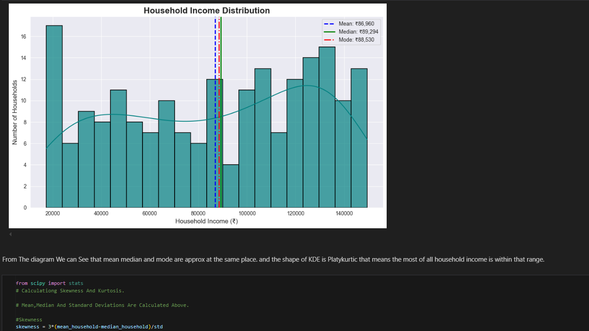

## 📸 Sample Output & Visualization

Box Plot Of Income Household By Education Level

# 🏡📈 Income Distribution & Household Analysis

Welcome to this insightful data analysis project that dives into the socio-economic patterns of households! Using Python, Pandas, Seaborn, and Matplotlib, we performed a detailed examination of household income distribution, education levels, urban-rural demographics, and more.

---

## 📁 Dataset Overview

| 🧾 Column Name             | 📊 Data Type   | 📃 Description                                      |
|---------------------------|----------------|-----------------------------------------------------|
| `Household_ID`            | Categorical     | Unique household identifier                        |
| `Age_of_Household_Head`   | Numerical       | Age of the head of household                       |
| `Household_Income`        | Numerical       | Monthly income in local currency                   |
| `Education Level`         | Categorical     | Primary / Secondary / Graduate / Post-Grad         |
| `Family_Size`             | Numerical       | Total number of family members                     |
| `Owns House`              | Categorical     | Whether the household owns a house (Yes/No)        |
| `Urban Rural`             | Categorical     | Classifies location as Urban or Rural              |

---

## 🔍 What We Explored

### ✅ Data Type Classification
We first identified and categorized the data columns into numerical and categorical for appropriate analysis.

### 📊 Visualization: Histogram by Education & Urban Areas
We visualized the distribution of household income based on:
- Education Level
- Urban vs Rural context  
This helped identify disparities in income levels across education and location.

### 📐 Central Tendency
Calculated:
- Mean
- Median
- Mode  
For both `Household_Income` and `Age_of_Household_Head` to understand the general trend of data.

### 📏 Dispersion Analysis
Computed:
- Range
- Variance
- Standard Deviation
- Skewness
- Kurtosis  
To measure spread, outliers, and shape of distribution.

---

## 📌 Tools Used
- 🐍 Python
- 🧮 NumPy & Pandas
- 📉 Matplotlib & Seaborn
- 📓 Jupyter Notebook

---

## 📚 Learnings & Insights
- Income is not normally distributed; often right-skewed due to a few high-income households.
- Urban areas tend to have higher income ranges compared to rural.
- Education level strongly correlates with household income.

---

## 🚀 How to Run
1. Clone this repository
2. Open `IncomeDistribution.ipynb` in Jupyter Notebook
3. Run all cells step-by-step
4. Analyze visuals and summary statistics

---

## 🙌 Acknowledgements
Special thanks to the dataset designer and mentors who guided this analysis.

✨ _Happy Analyzing!_ 📊📚
